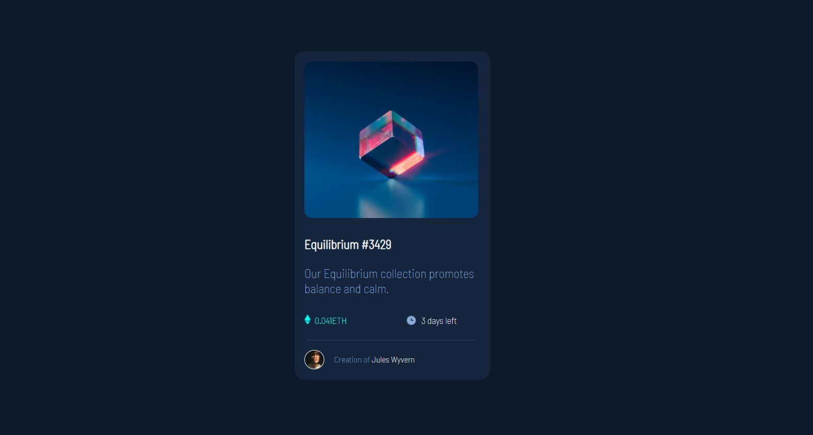

# NFT Card Preview Component

This project is a simple HTML and CSS implementation of an NFT card preview component. It's based on the Frontend Mentor challenge, [NFT Preview Card Component](https://www.frontendmentor.io/challenges/nft-preview-card-component-SbdUL_w0U).



You can view the live demo of this project here: [NFT Card Demo](https://mehwishjbe.github.io/nft-card/)

## Table of Contents

- [Description](#description)
- [Technologies Used](#technologies-used)
- [Usage](#usage)
- [Contributing](#contributing)
- [License](#license)

## Description

This project is a static web page that showcases an NFT card with the following features:
- NFT image display.
- NFT name and description.
- Price in Ethereum (ETH).
- Countdown timer indicating the time left for the sale.
- Creator's avatar and name.

The project is built using HTML for structure and CSS for styling.

## Technologies Used

- HTML
- CSS

## Usage

You can use this project as a starting point for creating your own NFT card components or as a reference for implementing similar designs. To use it, simply clone the repository to your local machine:

```bash
git clone https://github.com/mehwishjbe/nft-card.git
